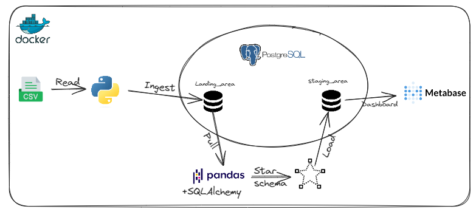
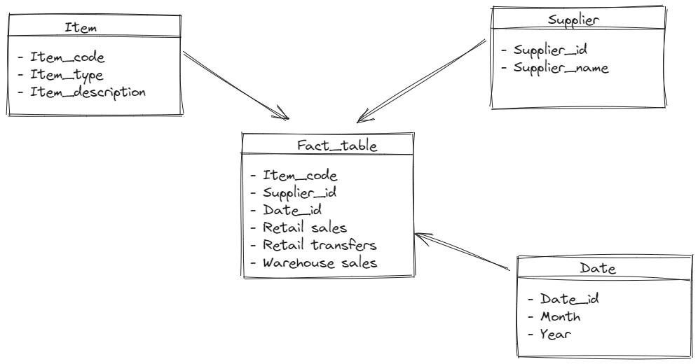
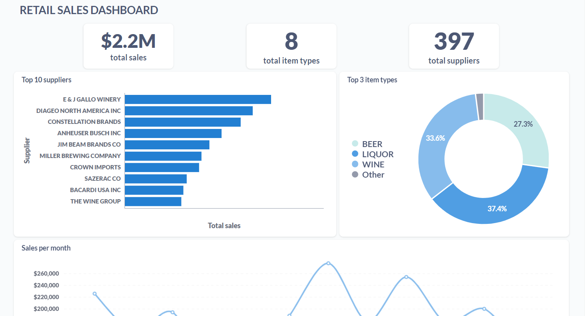
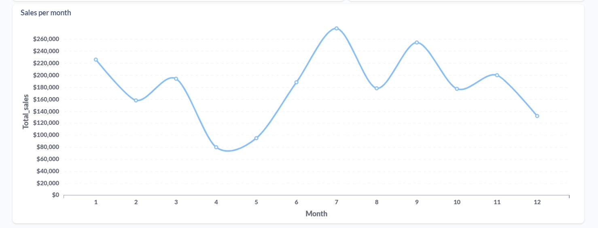

# Overview

## Tech Stack 
* Docker
* Python
* Metabase
* Postgresql

## Project Overview 
In this project, we will initially use Python and SQLAlchemy to load a CSV file containing a list of sales and movement data by item and month, in a schema on Postgres called "landing_area" (see pipeline/raw_data_to_landing.py). We will then apply some transformation logic on that table with Pandas to build a star schema, and subsequently load it into the "staging_area" for visualization.

## Run the pipeline
Here are the commands to set up the environment:
* `make up`: Create and run all the containers.
* `make ci`: Format, and run the tests
* `make etl`: Run the pipeline.
* `make warehouse`: Connect to the Postgres database and check the data.
* Go to localhost:3000 to open Metabase.
* `make down`: Stop the containers.

## Date model

## Dashboard

